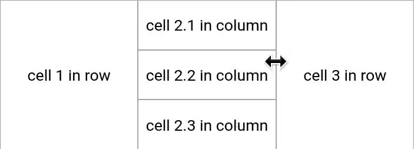

# svelte-layout-resizable

resizable layout component for svelte

## usage

in your `App.svelte` add

```html
<script>
  import L from 'svelte-layout-resizable';
</script>
<L row>
  <L>cell 1 in row</L>
  <L column>
    <L>cell 2.1 in column</L>
    <L>cell 2.2 in column</L>
    <L>cell 2.3 in column</L>
  </L>
  <L>cell 3 in row</L>
</L>
```

result:



`<L row>` is a broad container with css `flex-direction: row`

`<L column>` is a tall container with css `flex-direction: column`

if you dont like the `<L>` syntax  
you can do `import Layout from 'svelte-layout-resizable';`  
and use `<Layout>cell</Layout>`

## build

the component uses `<style lang="scss">`  
so we add to `rollup.config.js`:

```js
import sveltePreprocess from 'svelte-preprocess';

export default {
  plugins: [
    svelte({
      preprocess: [
        // transform scss (etc) in svelte components
        sveltePreprocess(),
      ],
    }),
  ],
};
```

and install

```sh
npm i -D svelte-preprocess scss
```

## style

the component defines only a minimal style  
to implement containers and resize-handles

most users want to add style to their `App.svelte`, like

```html
<style>
  /* layout */
  :global(body) {
    /* use full window size */
    padding: 0;
  }
  :global(.layout-cell>.middle>.center) {
    /* content cell: add scrollbars when needed */
    overflow: auto;
  }
  :global(.layout-cell>*>.frame) {
    /* frame color and border */
    /*background-color: #f4f4f4;*/
    border: solid 0.5px #a8a8a8;
  }
  :global(.layout-cell>*, .layout-cell>*>.frame) {
    /* frame size
       larger frames are better acccessible (touchscreen) */
    flex-basis: 2.5px !important;
  }
  /* use css classes on cells like
     <L class="overflow-hidden">....</L> */
  :global(.layout-cell>.middle>.center.overflow-hidden) {
    overflow: hidden !important;
  }
  /* use css classes on containers like
     <L row class="custom-row-container">....</L> */
  :global(.layout-row.custom-row-container) {
    color: orange;
  }
</style>
```

## related

* [goldenlayout.js](https://golden-layout.com/) (RIP jQuery)
* [svelte-subdivide](https://github.com/sveltejs/svelte-subdivide) [[v3](https://github.com/saabi/svelte-subdivide/tree/v3)]
* [svelte-grid](https://github.com/vaheqelyan/svelte-grid)
* [other svelte layout components](https://svelte-community.netlify.app/code/?tag=layout+and+structure) in svelte-community

## todo 

* online demo  
  problem: [inliner](https://github.com/remy/inliner) produces empty `<body>`  
  also `save page` in browser dont work

* avoid changing body style?  
  only 'stop selecting text' in layout containers?

* fix resize bug with many cells  
  like a 3x3 layout  
  in the center container

*  fix newStyle.marginLeft and newStyle.marginTop

* allow to hide/deactivate resize handles  
  on the outside of a class="root" container
  (better: find root container automatically)

* allow resize from corner handles?

* imitate goldenlayout.js and [qt dockable widgets](https://doc.qt.io/qt-5/qtwidgets-mainwindows-dockwidgets-example.html)  
  maybe as a separate node package, keep it small

  * allow to drag/move and dock cells to other containers

  * allow to expand one cell over the root layout

* add a tab widget? out of scope?  
  we already have [svelte-tabs](https://github.com/joeattardi/svelte-tabs)

* support 'live resize' of layout  
  con: need more CPU/GPU = debounce to like 10 FPS

* beforeUpdate or onMount  
  calculate sizes of all cells  
  so when we have
  ```
  <L>
    <L s="0.6">1</L>
    <L>2</L>
  </L>
  ```
  then cell 2 should have size 0.4  
  and not what css-flex suggests  
  based on content size  
  or did we use flex wrong?

* check bounds on resize  
  eventually shrink more cells

* verify overflow on resize  
  avoid unnecessary scrollbars

## license

[license](LICENSE) is creative commons zero 1.0
